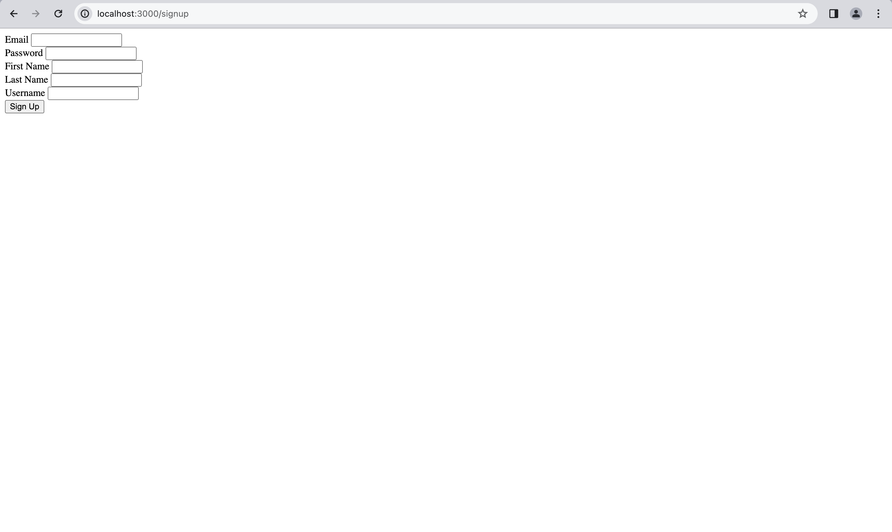
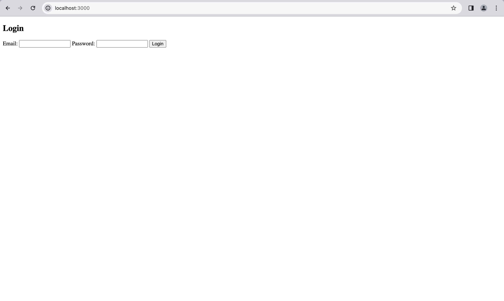
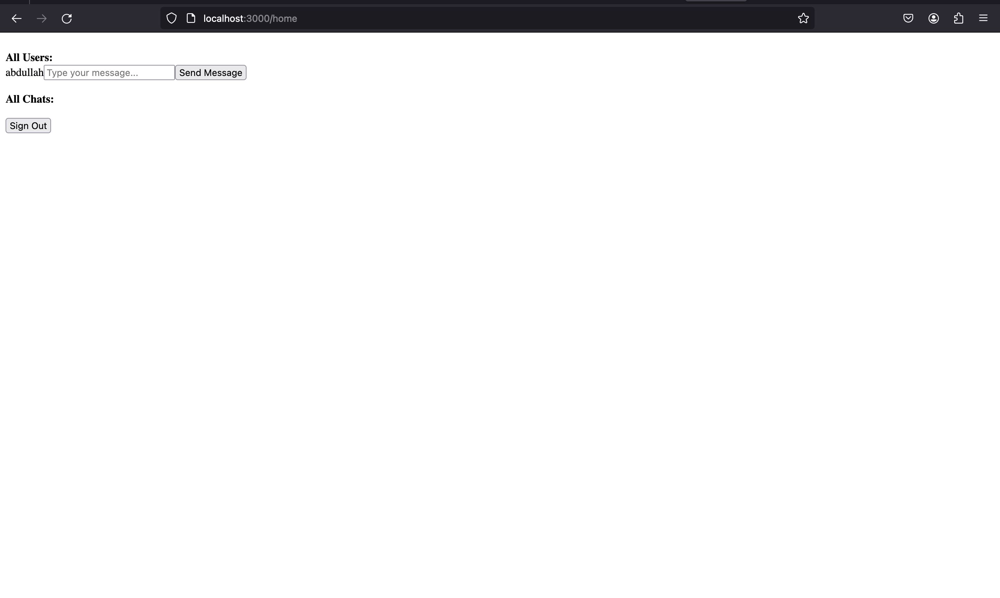
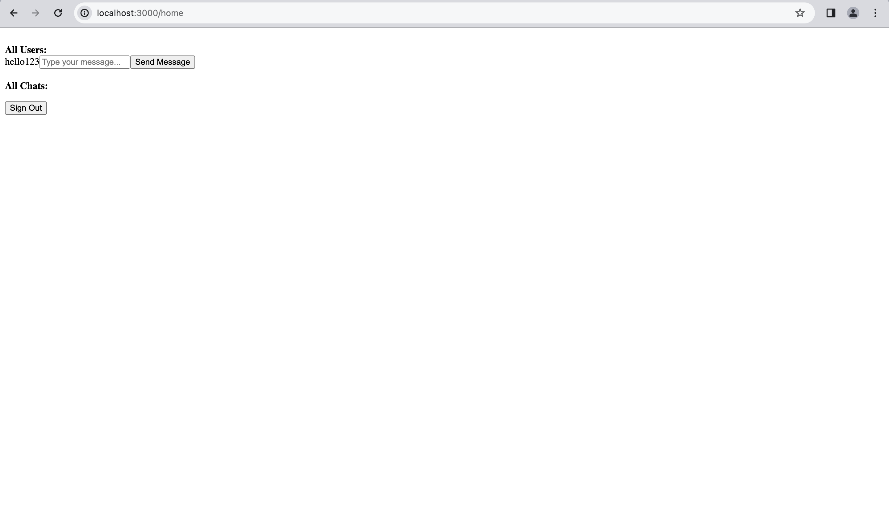
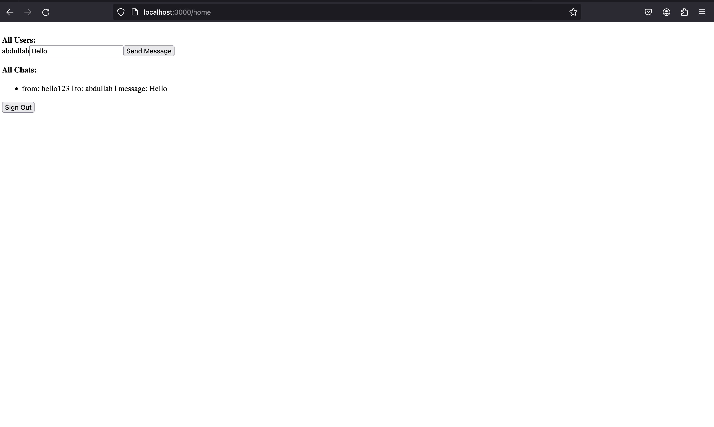
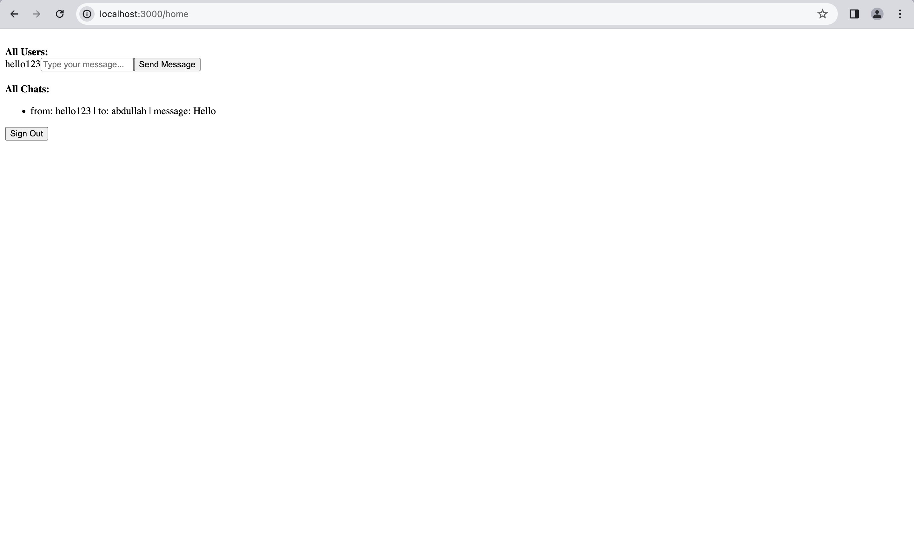
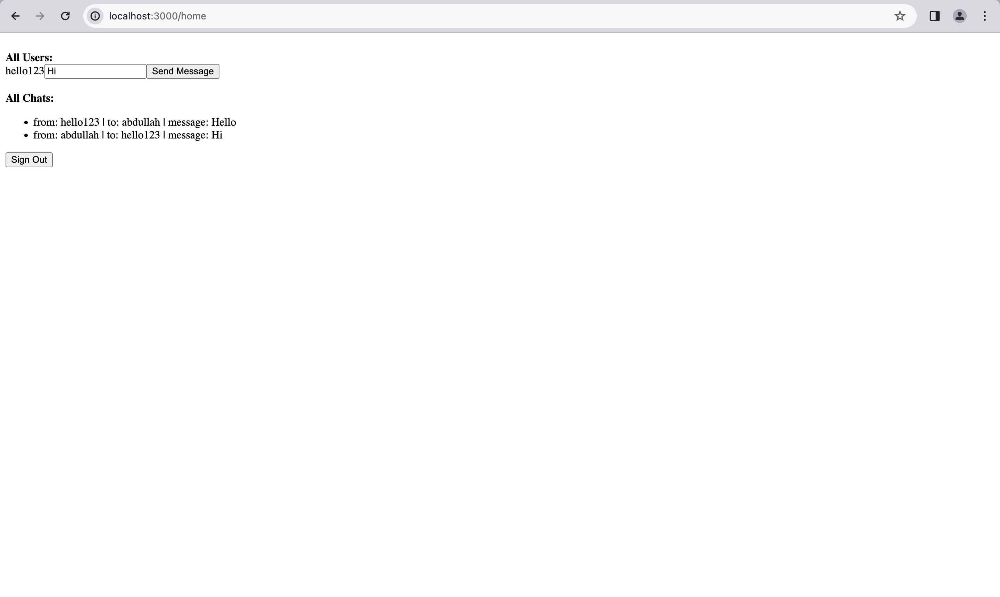

## Pre-requsites

1. First, you will need have postgres installed in your system. Also, you should have a db named 'chatdb' created.

You can run postgres using the following command:
```
docker run -e POSTGRES_PASSWORD=postgres -e POSTGRES_USER=postgres -e POSTGRES_DB=chatdb -p 5432:5432 -it postgres
```

2. You should have node installed in your system. You can install it by following this tutorial.
https://www.educative.io/answers/how-to-install-nodejs-on-ubuntu

3. Run `npm install`

4. Create an `.env` file with the variables shown in the `.env.example` file.

5. Now the application is being served at http://localhost:3000. You should follow the following steps now:

* Go to http://localhost:3000/signup and sign up by providing the valid information. 



Once signed up, it will redirect you to the http://localhost:3000 page where it will ask you to login.



* After logging in, you will see the following screen:



* Now, open another private tab or browser and follow the steps for sign-up and login. Now, refresh both tabs and you will see this:



* Now send message from the first tab and see the second tab. You will see the message have been received in the second tab:





* Now do the opposite. Now send message from the second tab. You will see the message have been received in the first tab:




If you want to try it out with different users, you can. Also, there is a logout functionality as well.

## What is happening on the backend?

* On sign up, a user is registered.
* On login, a user gets the auth token which the frontend saves in the cookies to make more requests. 
* As soon as the user lands on the home page after logging in, a seperate socket is creating for him through which it can receive messages. To send messages, it will use the `.emit` function of other user's sockets.
* As soon as we send a message, that message is sent to both sender and receiver's socket so they both have the whole communication. 
* Also, on the first communication between two users, the chat entry is created in the database.

## Example .env file for local usage:
```
DB_HOST=localhost
DB_NAME=chatdb
DB_USER=postgres
DB_PASSWORD=postgres
DB_DIALECT=postgres
DB_ALTER_SCHEMA=true
DB_LOGGING_ON=true
```

Please feel free to reach out to me at abdullah.arshad.314@gmail.com, if you have any concerns. Thank you.